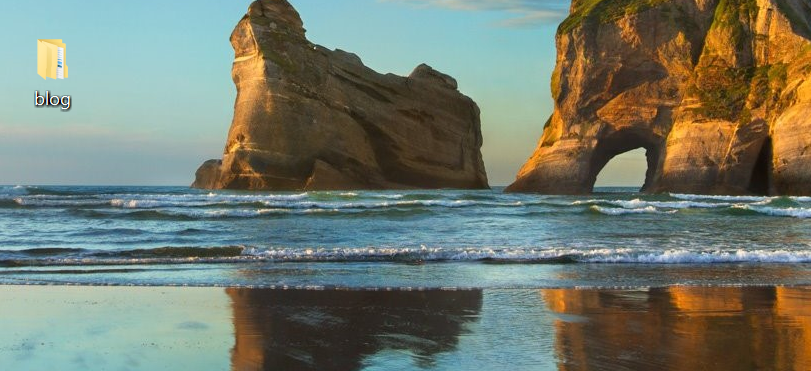
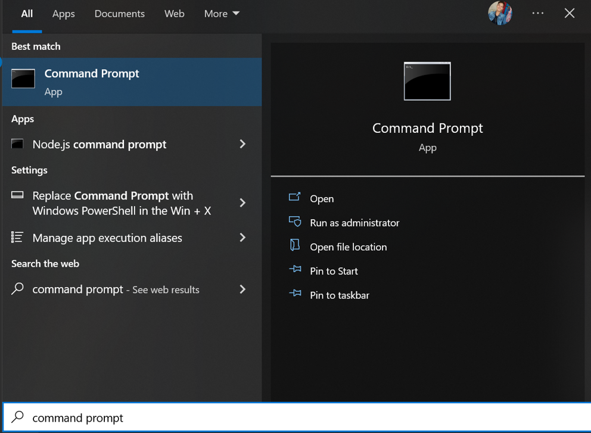
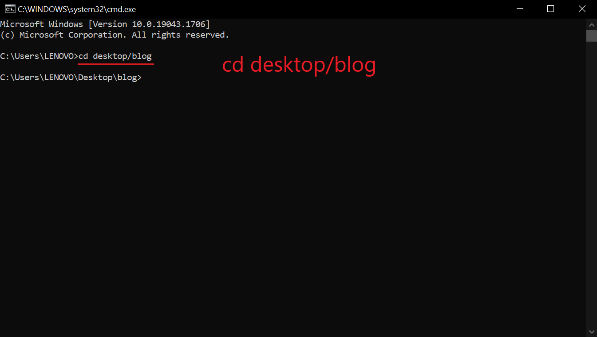
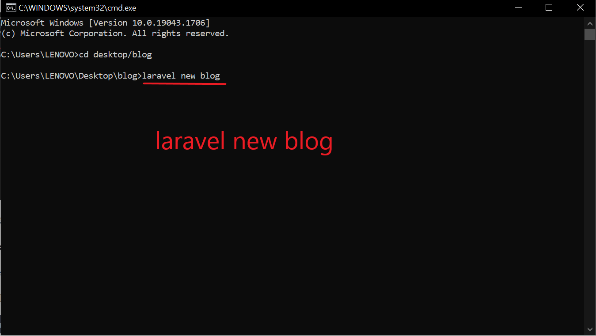
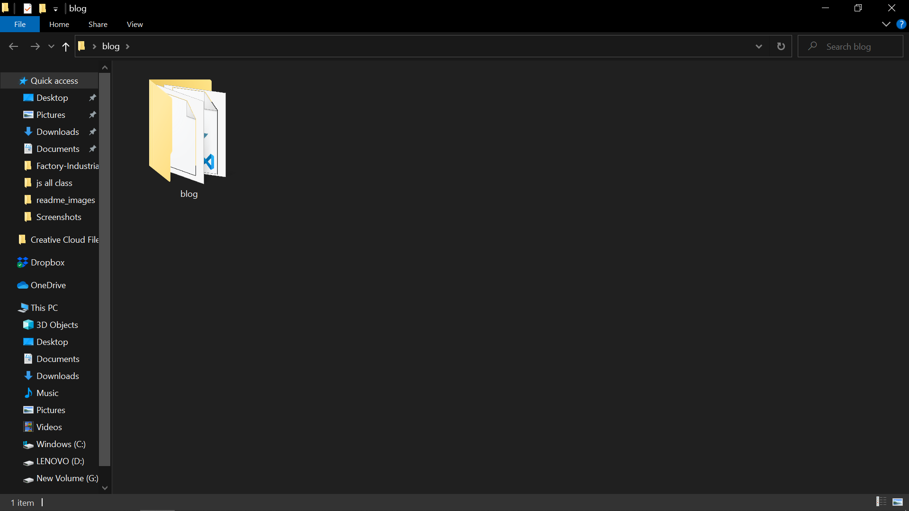
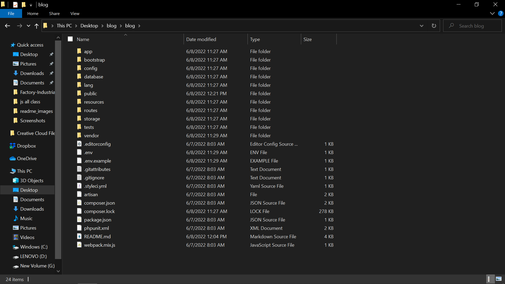

## About this project

<h1>Day 1</h1>
<h2>Whit should i do Today.</h2>
<h3><b>1.</b> First Step</h3>

download composer from <a href="https://getcomposer.org/download/">https://getcomposer.org/download/</a> and install it.

<h3><b>2.</b> Second Step</h3>

Create Folder From a Desktop this <strong>Name:-</strong>Blog

<h3><b>3.</b> Third Step</h3>

search <b>command prompt</b> on our search bar  and open it.

<h3><b>4.</b>Four Step</h3>

type there: <b>cd desktop/blog</b> and press the enter. look their image, terminal are goes inside the desktop blog directory.

<h3><b>5.</b>Five Step</h3>
<h4>Create a Laravel Project:</h4>

i will create laravel 9 application. inside the before i will create block directory.

<h4>after complete step 4, i have create laravel application in this laravel command.</h4>
<b style="background:#292D3E; color:#BFC7D5; padding:5px 50px;"><pre>laravel new app-name</pre></b>

this is command for making laravel project. <b>more details see the below image.</b>

here image i have create my laravel project/app name is <b> blog</b>

after the type <b>laravel new app-naem </b>press the enter and wait some minutes, will be completed the laravel app/project installation.

<h4>after the completed installation</h4>

Open you will be created forlder look their created once new folder inside the created folder. this is the laravel app/project <b>see the below image</b>

<h2>inside the project/app folder </h2>

see the below image

